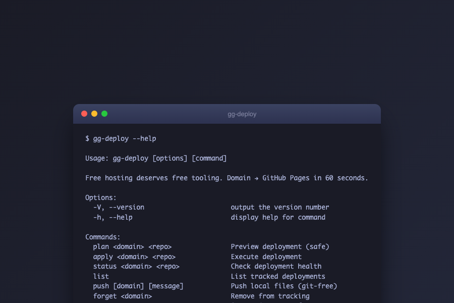
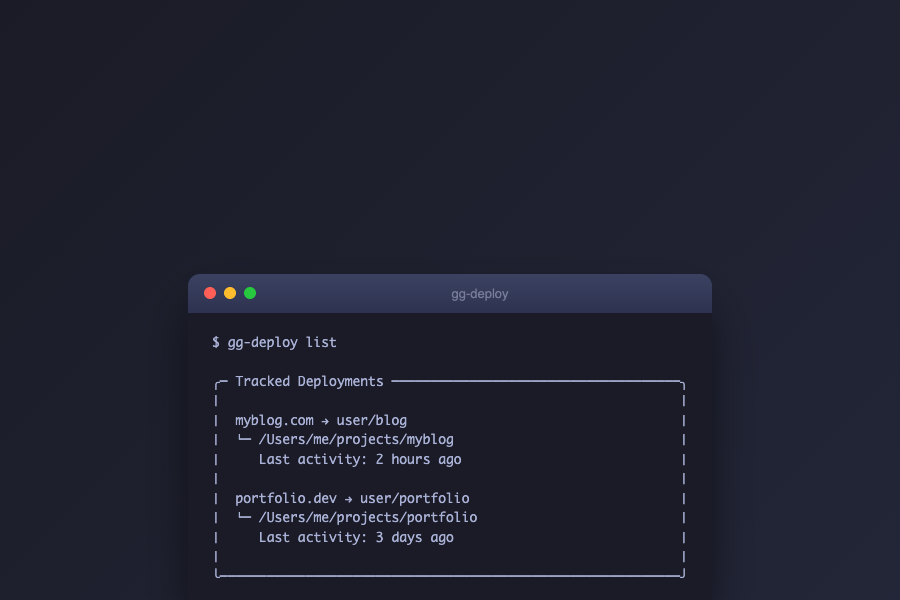
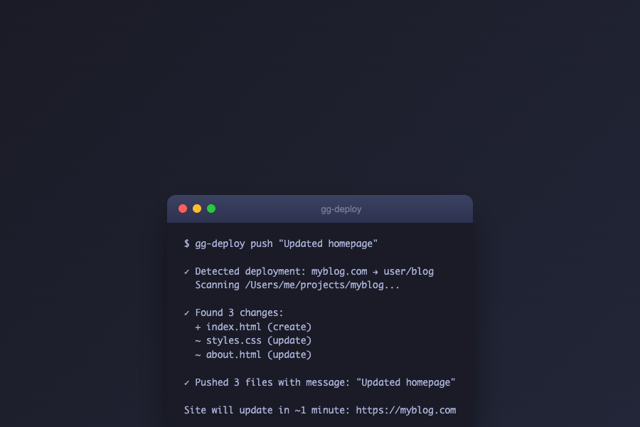
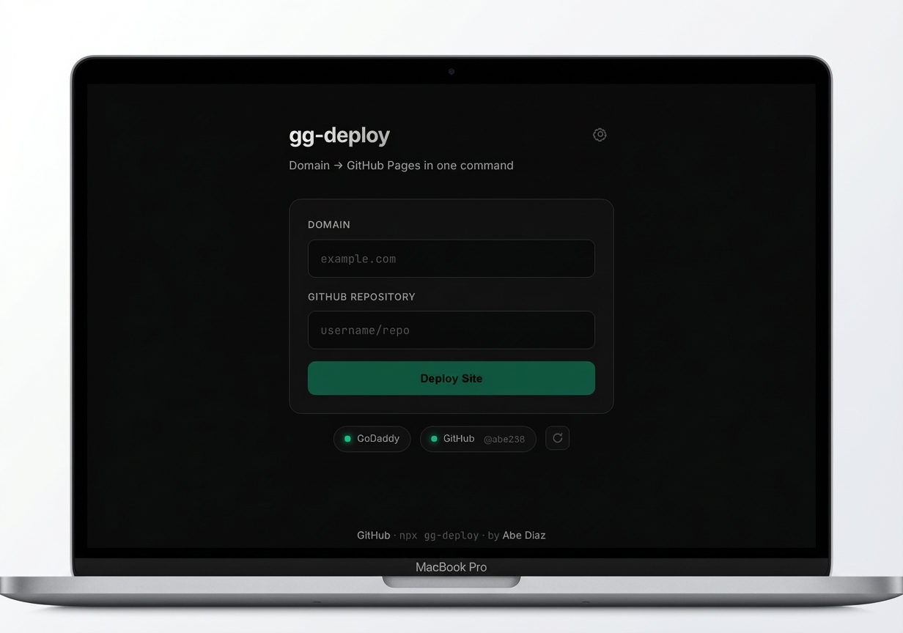
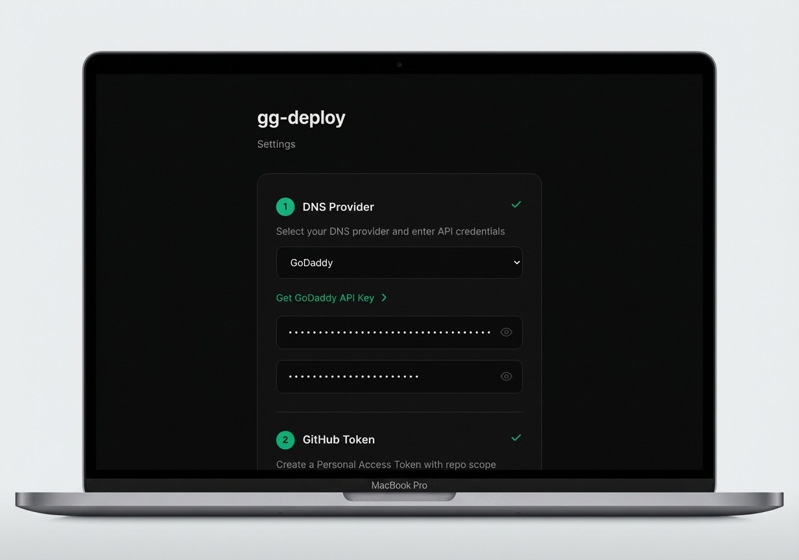
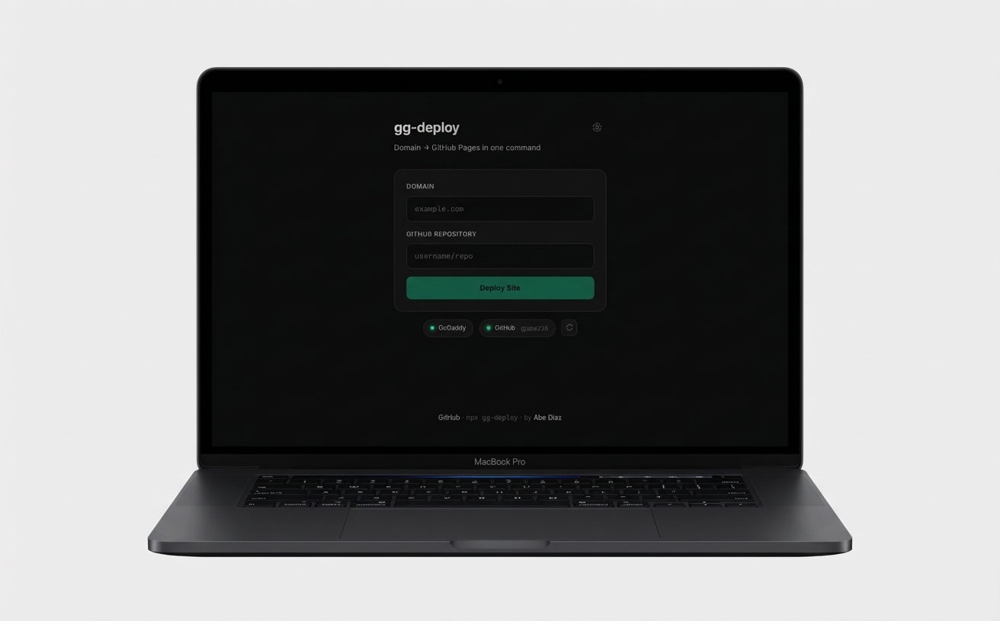
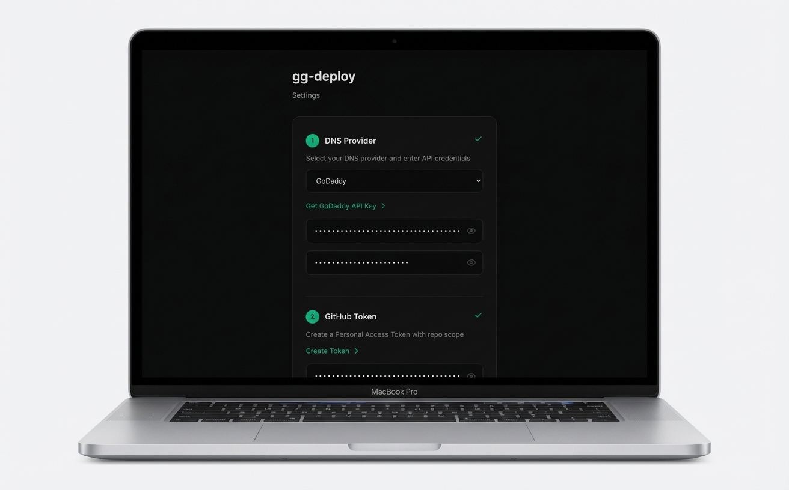

# gg-deploy

**Free hosting deserves free tooling. Domain → GitHub Pages in 60 seconds.**

gg-deploy is my latest: domain deployment automated, built in a weekend, open source, free forever. It's not going to save the world, but it might save you an hour of DNS configuration.

**One command. One click. One prompt.** Works via CLI, desktop app, web UI, or AI assistant (MCP).

## Quick Start

```bash
npx gg-deploy ui
# Opens http://localhost:3847
```

Or via CLI:
```bash
npx gg-deploy plan example.com user/repo    # Preview (safe)
npx gg-deploy apply example.com user/repo   # Deploy
npx gg-deploy status example.com user/repo  # Health check
```

## Why I Built This

GitHub Pages is free. Domain registration is cheap. But connecting them? That's still 15 minutes of DNS googling, A-record guessing, and "did I break my email forwarding again?" anxiety.

I wanted deployment to be as fast as the hosting is free (for public repos). So I built gg-deploy over a weekend; a CLI for power users, web UI for everyone else, MCP for AI agents, and desktop apps because why not.

**AGPL-licensed** because good tools should stay free.

## Screenshots

### CLI




### Desktop App



### Web UI



## Desktop App

Download from [GitHub Releases](https://github.com/abe238/gg-deploy/releases):
- **macOS**: `.dmg` (Apple Silicon or Intel)
- **Windows**: `.msi` installer
- **Linux**: `.AppImage` or `.deb`

### macOS First Run

The app isn't signed with an Apple certificate. On first launch:

**Option 1: Right-click method**
1. Right-click (or Control+click) on GG Deploy
2. Click "Open" from the menu
3. Click "Open" in the dialog

**Option 2: Terminal (one command)**
```bash
xattr -cr "/Applications/GG Deploy.app"
```

This is a one-time step—the app runs normally after.

### Windows First Run

Click **More info** → **Run anyway** on the SmartScreen prompt.

### Linux

Make executable and run:
```bash
chmod +x GG.Deploy_*.AppImage
./GG.Deploy_*.AppImage
```

## Requirements

- **Node.js 18+** — Check with `node --version`
- **DNS Provider account** — GoDaddy, Cloudflare, or Namecheap
- **GitHub account** with a Personal Access Token
- **Domain** managed by your DNS provider
- **GitHub repo** with your site content (index.html or built site)

### Provider Comparison

| Provider | Ease of Setup | API Access | Notes |
|----------|---------------|------------|-------|
| **Cloudflare** | Easy | Free for all | Recommended for new users |
| **GoDaddy** | Medium | Requires 10+ domains | Production key required |
| **Namecheap** | Medium | Requires IP whitelist | Must whitelist your IP |

## Setup

Credentials are saved once to `~/.gg-deploy/config.json` and work across all projects.

### Option 1: Web UI (Recommended)

```bash
npx gg-deploy ui
```

The setup wizard walks you through:
1. Creating a GoDaddy API key
2. Creating a GitHub token
3. Testing and saving credentials

### Option 2: Manual Config

Create `~/.gg-deploy/config.json` with your preferred DNS provider:

**Cloudflare (Recommended):**
```json
{
  "dnsProvider": "cloudflare",
  "cloudflare": {
    "apiToken": "YOUR_CLOUDFLARE_TOKEN"
  },
  "github": {
    "token": "ghp_YOUR_TOKEN"
  }
}
```

**GoDaddy:**
```json
{
  "dnsProvider": "godaddy",
  "godaddy": {
    "apiKey": "YOUR_KEY",
    "apiSecret": "YOUR_SECRET",
    "environment": "production"
  },
  "github": {
    "token": "ghp_YOUR_TOKEN"
  }
}
```

**Namecheap:**
```json
{
  "dnsProvider": "namecheap",
  "namecheap": {
    "apiUser": "YOUR_USERNAME",
    "apiKey": "YOUR_API_KEY",
    "clientIP": "YOUR_IP_ADDRESS"
  },
  "github": {
    "token": "ghp_YOUR_TOKEN"
  }
}
```

### Getting Credentials

**Cloudflare API Token (Recommended):**
1. Go to https://dash.cloudflare.com/profile/api-tokens
2. Click "Create Token"
3. Use "Edit zone DNS" template
4. Select the zone (domain) you want to manage
5. Copy the token

**GoDaddy API Key:**
1. Go to https://developer.godaddy.com/keys
2. Click "Create New API Key"
3. Select **Production** (not OTE/Test)
4. Copy Key and Secret immediately (secret shown only once)
5. Note: Requires account with **10+ domains**

**Namecheap API:**
1. Go to https://ap.www.namecheap.com/settings/tools/apiaccess/
2. Enable API access
3. **Whitelist your IP address** (required)
4. Copy API Key and Username
5. Get your current IP: `curl ifconfig.me`

**GitHub Token:**
1. Go to https://github.com/settings/tokens/new?description=gg-deploy&scopes=repo
2. Click "Generate token"
3. Copy the token (starts with `ghp_`)

## Web Interface

### Main Screen

| Element | Description |
|---------|-------------|
| **Domain field** | Your GoDaddy domain (e.g., `example.com`) |
| **Repository field** | GitHub repo as `username/repo` |
| **Deploy button** | Starts the deployment process |
| **Status badges** | Show GoDaddy/GitHub connection status |
| **Settings gear** | Opens credential management |

### Status Indicators

| Color | Meaning |
|-------|---------|
| Green (glowing) | Connected and verified |
| Yellow (pulsing) | Testing connection... |
| Red | Error (hover for details) |
| Gray | Not tested yet |

Hover over badges for detailed status. Click the refresh button to re-test connections.

### Settings Screen

- **API Key / Secret / Token fields** — Pre-filled with saved values (masked)
- **Eye icon** — Click to reveal value for copying
- **Status indicators** — Show live verification status
- **Test button** — Re-verify API connections
- **Update Settings** — Save changes

### Deployment Flow

1. Enter domain and repo
2. Click Deploy
3. Watch real-time progress:
   - Verify domain ownership
   - Check repository access
   - Configure DNS records
   - Add CNAME file
   - Enable GitHub Pages
   - Provision SSL certificate
4. Get your live URL

## CLI Commands

| Command | Description | Safe | Git Required |
|---------|-------------|------|--------------|
| `plan <domain> <repo>` | Preview changes | Yes | No |
| `apply <domain> <repo>` | Execute deployment | No | No |
| `status <domain> <repo>` | Check health | Yes | No |
| `list` | Show all tracked deployments | Yes | No |
| `push [domain] [message]` | Upload local file changes | No | **No** |
| `forget <domain>` | Remove from tracking | Yes | No |
| `ui` | Launch web interface | Yes | No |
| `mcp-serve` | Start MCP server | Yes | No |
| `update` | Check for updates | Yes | No |
| `describe` | Output AI-friendly tool schema | Yes | No |

Add `--output json` for machine-readable output.

### Git-Free File Updates

The `push` command uploads your local files directly to GitHub via API—no git knowledge required:

```bash
# From your project directory (auto-detects deployment)
gg-deploy push "Updated homepage"

# Or specify the domain explicitly
gg-deploy push myblog.com "Fixed typo in about page"
```

**How it works:**
1. Scans your local directory for changed files
2. Compares SHA hashes with GitHub
3. Uploads only changed files via GitHub Contents API
4. Files >1MB use Git Data API for reliability
5. Files >100MB are skipped (GitHub limit)

**Respects `.gitignore` and `.gg-ignore`** — node_modules, .env, and other patterns are automatically excluded.

### Deployment Tracking

After `apply` succeeds, gg-deploy remembers your deployment:

```bash
# List all tracked deployments
gg-deploy list

# Output:
# ╭─ Tracked Deployments ─────────────────────────────────────╮
# │  myblog.com → user/blog                                   │
# │  └─ /Users/me/projects/myblog                             │
# │     Last activity: 2 hours ago                            │
# ╰───────────────────────────────────────────────────────────╯
```

To stop tracking (doesn't affect live site):
```bash
gg-deploy forget myblog.com
```

**Note:** `forget` only removes local tracking. Your DNS records and GitHub Pages remain active. See the output for cleanup instructions.

## AI Agent Integration (MCP)

gg-deploy includes a full MCP (Model Context Protocol) server, enabling AI assistants to deploy and manage sites directly.

**Compatible with:**
- Claude Desktop
- Claude Code
- Cursor
- Windsurf
- N8N (workflow automation)
- Any MCP-compatible client

### Setup

**Claude Desktop / Claude Code** — Add to config:

macOS: `~/Library/Application Support/Claude/claude_desktop_config.json`
Windows: `%APPDATA%\Claude\claude_desktop_config.json`

```json
{
  "mcpServers": {
    "gg-deploy": {
      "command": "npx",
      "args": ["-y", "gg-deploy", "mcp-serve"]
    }
  }
}
```

**Cursor / Windsurf** — Add to MCP settings with the same configuration.

**N8N** — Use the MCP node with command: `npx -y gg-deploy mcp-serve`

### Available MCP Tools

| Tool | Description | Safe |
|------|-------------|------|
| `deploy_site_plan` | Preview deployment changes | Yes |
| `deploy_site_apply` | Execute DNS + GitHub Pages deployment | No |
| `deploy_site_status` | Check deployment health | Yes |
| `list_deployments` | List all tracked deployments | Yes |
| `push_changes` | Upload local file changes | No |

### Example Prompts

- "Deploy myblog.com to user/repo"
- "Check the status of example.com"
- "What deployments do I have?"
- "Push my latest changes to the blog"

### AI Discovery

Run `gg-deploy describe` to get a comprehensive JSON schema with:
- Command descriptions and intents
- Example inputs and outputs
- Safety indicators (safe/requires confirmation)
- Recommended usage flows

## Troubleshooting

### Node.js Issues

| Problem | Solution |
|---------|----------|
| `node: command not found` | Install Node.js from https://nodejs.org |
| `unsupported engine` | Upgrade to Node.js 18+ |
| `EACCES permission denied` | Don't use `sudo`. Fix npm permissions or use nvm |

### GoDaddy API Issues

| Problem | Solution |
|---------|----------|
| `401 Unauthorized` | Wrong API key/secret. Regenerate at developer.godaddy.com |
| `403 Forbidden` | API key is for OTE (test). Create a **Production** key |
| `404 Not Found` | Domain not in your GoDaddy account |
| `422 Invalid` | Domain locked or has pending transfers |
| `403 Access denied` | Account needs **10+ domains** for API. Use Cloudflare instead |
| Red status dot | Hover for error. Usually auth issue |

### Cloudflare API Issues

| Problem | Solution |
|---------|----------|
| `401 Unauthorized` | Invalid API token. Regenerate at dash.cloudflare.com |
| `403 Forbidden` | Token doesn't have Edit DNS permission. Create new token |
| Zone not found | Domain not in your Cloudflare account or wrong zone |
| Records not applying | Ensure `proxied: false` for GitHub Pages (handled automatically) |

### Namecheap API Issues

| Problem | Solution |
|---------|----------|
| `1011150 IP not whitelisted` | Add your IP at ap.www.namecheap.com/settings/tools/apiaccess |
| `500000 Rate limited` | Wait a few minutes, API has rate limits |
| Authentication failed | Check apiUser and apiKey are correct |
| Domain not found | Domain must be active in your Namecheap account |
| Records overwritten | Namecheap API replaces ALL records. Backup is created automatically |

### GitHub API Issues

| Problem | Solution |
|---------|----------|
| `401 Bad credentials` | Token expired or invalid. Generate new one |
| `403 Forbidden` | Token missing `repo` scope. Regenerate with correct scope |
| `404 Not Found` | Repo doesn't exist or token can't access it |
| Private repo fails | Need GitHub Pro for private repo Pages |

### DNS Issues

| Problem | Solution |
|---------|----------|
| Site not loading | Wait 10-60 min for DNS propagation |
| Wrong IP showing | Clear DNS cache: `sudo dscacheutil -flushcache` (Mac) |
| SSL not working | GitHub needs DNS to resolve first. Check Pages settings |

### Config Issues

| Problem | Solution |
|---------|----------|
| "Not configured" | Check `~/.gg-deploy/config.json` exists |
| Can't find config | It's in your home directory: `ls -la ~/.gg-deploy/` |
| Permission denied | Run `chmod 600 ~/.gg-deploy/config.json` |

### UI Issues

| Problem | Solution |
|---------|----------|
| Port 3847 in use | Kill existing: `lsof -i :3847` then `kill <PID>` |
| Blank page | Clear browser cache or try incognito |
| Eye icon not working | Click reveals value if credentials are saved |

### Common Fixes

```bash
# Check if config exists
cat ~/.gg-deploy/config.json

# Verify Node version
node --version  # Should be 18+

# Test GoDaddy API manually
curl -H "Authorization: sso-key YOUR_KEY:YOUR_SECRET" \
  https://api.godaddy.com/v1/domains

# Test GitHub API manually
curl -H "Authorization: Bearer ghp_YOUR_TOKEN" \
  https://api.github.com/user
```

## How It Works

1. **DNS** — Sets A records to GitHub IPs (185.199.108-111.153) + www CNAME
2. **CNAME** — Creates CNAME file in repo with your domain
3. **Pages** — Enables GitHub Pages on main branch
4. **SSL** — GitHub auto-provisions Let's Encrypt certificate

Total time: ~60 seconds. DNS propagation: 10-60 minutes.

## Security

- Credentials stored in `~/.gg-deploy/config.json` (permission 600)
- Never committed to git
- Eye icon reveals values only locally
- API calls made directly to GoDaddy/GitHub (no proxy)

## Limitations

- Supports GoDaddy, Cloudflare, and Namecheap (other providers coming)
- GoDaddy requires 10+ domains for API access
- Namecheap requires IP whitelist configuration
- Public repos or GitHub Pro required for Pages
- Only www subdomain supported
- One domain per deployment

## License

AGPL-3.0 — Free to use, modify, and distribute. Forks must remain open source.

---

## About the Builder

Hola. I'm **[Abe Diaz](https://abediaz.ai)**. By day, I'm Sr. Manager of Disaster Relief at Amazon, leading a team that uses AI and logistics to deliver 26+ million relief items and response technology across 200+ disasters worldwide. On weekends, I build artisanal developer tools like this :-P

- 💼 [linkedin.com/in/abediaz](https://linkedin.com/in/abediaz)
- 🌐 [abediaz.ai](https://abediaz.ai)
- 🐙 [github.com/abe238](https://github.com/abe238)
- 🐦 [@abe238](https://twitter.com/abe238)

### Other Open Source Projects

| Project | Description |
|---------|-------------|
| [gemini-deep-research](https://github.com/abe238/gemini-deep-research) | CLI for Gemini's Deep Research Agent |
| [aipm-resume-analyzer](https://github.com/abe238/aipm-resume-analyzer) | Resume analysis against AI PM frameworks |
| [project-kickoff](https://github.com/abe238/project-kickoff) | Scaffold AI production-ready projects |
